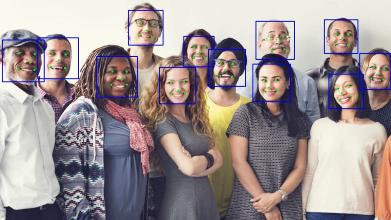

# Cross Compiling Landmark Detection Application for ARM32 / ARM64

For a step by step explanation, please refer to [this article](https://medium.com/trueface-ai/trueface-tutorials-how-to-cross-compile-popular-computer-vision-c-frameworks-for-raspberry-pi-4-afcbe2dcc302)

## Build Steps

### AArch32
* Navigate to the `3rd_party_libs` directory and run the following:
    * `./build_ncnn.sh`
    * `./build_opencv.sh`
* Navigate back to the root directory
    * `mv CMakeLists.txt.aarch32 CMakeLists.txt`
    * `mkdir build_aarch32`
    * `cd build_aarch32`
    * `cmake ..`
    * `make -j$(nproc)`

### AArch64
* Navigate to the `3rd_party_libs` directory and run the following:
    * `./build_ncnn.sh -b aarch64`
    * `./build_opencv.sh -b aarch64`
* Navigate back to the root directory
    * `mv CMakeLists.txt.aarch64 CMakeLists.txt`
    * `mkdir build_aarch64`
    * `cd build_aarch64`
    * `cmake ..`
    * `make -j$(nproc)`
